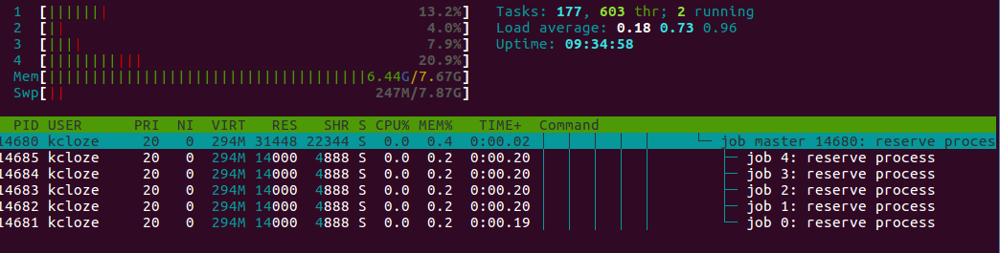

# swoole-jobs

* 基于swoole的job调度组件

## 1. 使用场景

* web中较慢的逻辑，比如统计/email/短信/图片处理等
* 单机job任务并发数10000以内，但可以多机器部署

## 2. 架构图


## 3. 特性

* 基于swoole的job调度组件；
* redis/rabbitmq/zeromq等任何一种做队列消息存储(目前只实现redis/rabbitmq)；
* 利用swoole的process实现多进程管理，进程个数可配置，worker进程退出后会自动拉起；
* 子进程循环次数可配置，防止业务代码内存泄漏；
* 支持topic特性，不同的job绑定不同的topic；支持优先队列，根据topic顺序消费；
* 支持composer，可以跟任意框架集成；
* 日志文件自动切割，默认最大100M，最多5个日志文件，防止日志刷满磁盘；


## 4. 安装


```
git clone https://github.com/kcloze/swoole-jobs.git
cd swoole-jobs
composer install

```
## 5. 运行

```
1.修改配置config.php

2.启动服务
php ./run.php start|stop|restart

3.往队列推送任务
php ./test/testJobs.php

```

## 6. 服务管理
### 启动和关闭服务,有两种方式:

#### 6.1 php脚本(主进程挂了之后,需要手动启动)
```
./run.php start|stop|restart

```

#### 6.2 使用systemd管理(故障重启、开机自启动)
[更多systemd介绍](https://www.swoole.com/wiki/page/699.html)

```
1. 根据自己项目路径,修改 systemd/swoole-jobs.service
2. sudo cp -f systemd/swoole-jobs.service /etc/systemd/system/
3. sudo systemctl --system daemon-reload
4. 服务管理
#启动服务
sudo systemctl start swoole-jobs.service
#reload服务
sudo systemctl reload swoole-jobs.service
#关闭服务
sudo systemctl stop swoole-jobs.service
```





## 7. change log

#### 2017-11-29
* 重构自身和第三方框架装载类实现，降低耦合性；
* 支持Yii和Phalcon主流框架


#### 2017-11-28 16:52:42 
* topics支持根据key值排序，队列根据这个排序优先消费；
* 优化启动流程，让PHP进程自身管理，移除服务管理脚本；
* 重构代码，优化结构；


#### 2017-11-28 00:27:42 

> by [daydaygo](http://github.com/daydaygo)

- 优化 TopicQueue 实现: `TopicQueueInterface -> BaseTopicQueue -> XxxTopicQueue`
- 优化 job run() 方式, 增加类静态方法实现, 并实现多参数输入
- 使用依赖注入方式进行解耦, 比如 `Jobs` 类依赖 `BaseTopicQueue` 抽象类, 不和具体的 `TopicQueue` 实现耦合; 比如配置的解耦, `Jobs` 类只用关系自己业务相关的配置, 不用耦合其他配置
- 添加 php 进行服务管理

#### 2017-5-19

* 增加使用systemd管理swoole服务,实现故障重启、开机自启动等功能

## 8. 注意事项

* 如果嵌入自己的框架，jobs类可以自己根据框架路径自由定义，详情看src/Jobs.php


## 9. 压测

* 瓶颈: redis/rabbitmq队列存储本身和job执行速度


## 10. 感谢

* [swoole](http://www.swoole.com/)

## 11. 联系

qq群：141059677


