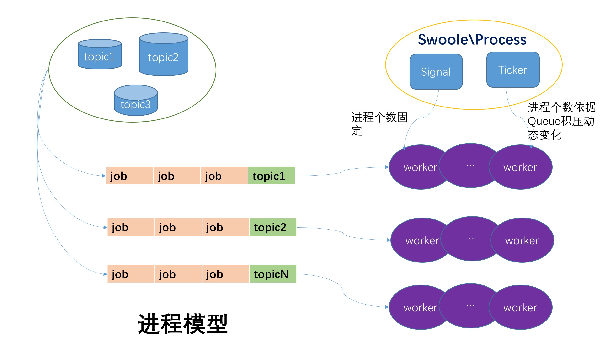
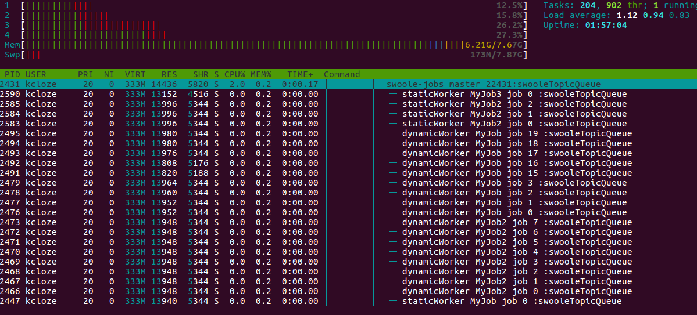

# swoole-jobs

* 基于swoole类似gearman的分布式任务处理系统
* 高性能/动态多woker进程消费队列，加速后端耗时服
* 无需像gearman一个worker配置一条crontab，swoole-jobs负责管理所有worker状态
* 独立的swoole http api 入队列，api不依赖php-fpm


## 1. 说明

* web中较慢的逻辑，比如统计/email/短信/图片处理等；
* 支持redis/rabbitmq/zeromq等任何一种做队列消息存储；
* 比yii／laravel等框架自带队列更稳定更快[消费进程可动态变化]
* 自带yii2/phalcon/yaf/ThinkPHP5集成示例，其他框架可参考src/Action代码，
* [yii2完整示例](https://github.com/kcloze/swoole-jobs-yii2)
* [ThinkPHP5完整示例](https://github.com/kcloze/swoole-jobs-tp5)


## 2. 架构图





## 3. 特性

* 基于swoole的job调度组件；类似gearman的分布式任务处理系统；
* redis/rabbitmq/zeromq等任何一种做队列消息存储(目前只实现redis/rabbitmq)；
* 利用swoole的process实现多进程管理，进程个数可配置，worker进程退出后会自动拉起；
* 子进程循环次数可配置，防止业务代码内存泄漏；默认stop命令会等待子进程平滑退出；
* 支持topic特性，不同的job绑定不同的topic；
* 每个topic启动对应数量的子进程，杜绝不同topic之间相互影响;
* 根据队列积压情况，子进程动态启动进程数，最大子进程个数可配置；
* 支持composer，可以跟任意框架集成；
* 日志文件自动切割，默认最大100M，最多5个日志文件，防止日志刷满磁盘；
* 出现积压情况，支持钉钉机器人等消息提醒；


## 4. 安装

#### 4.1 composer
```
git clone https://github.com/kcloze/swoole-jobs.git
cd swoole-jobs

```


```
composer install
```
#### 4.2 docker
* git clone https://github.com/kcloze/swoole-jobs.git
* cd swoole-jobs and composer install
* 根据根目录Dockerfile构建镜像
* docker build -t swoole-jobs .
* docker run  -it  -v ~/data/code/php:/data swoole-jobs /bin/bash
* 进入容器之后，进入项目目录：php swoole-jobs.php start

## 5. 运行

### 5.1 示范
```
1.修改配置config.php

2.启动服务
php ./swoole-jobs.php start >> log/system.log 2>&1

3.往队列推送任务
php ./tests/testJobsSerialzie.php

4.启动api服务
php ./swoole-jobs.php start http

5.停止api服务
php ./swoole-jobs.php stop http


```

### 5.2 启动参数说明
```
NAME
      php swoole-jobs - manage swoole-jobs

SYNOPSIS
      php swoole-jobs command [options]
          Manage swoole-jobs daemons.


WORKFLOWS


      help [command]
      Show this help, or workflow help for command.

      restart
      Stop, then start swoole-jobs master and workers.

      start
      Start swoole-jobs master and workers.

      start http
      Start swoole http server for apis.

      stop
      Wait all running workers smooth exit, please check swoole-jobs status for a while.
      
      stop http
      Stop swoole http server for api.

      exit
      Kill all running workers and master PIDs.

      exit http
      Stop swoole http server for api.


```

### 5.3 api参数说明

#### 5.3.1 api url
* http://localhost:9501/pushJobs

#### 5.3.2 api params:

| Params       | Type           | Demo  |
| ------------- |:-------------:| -----:|
|   jobData    | json | {"topic":"MyJob","jobClass":"\\Kcloze\\Jobs\\Jobs\\MyJob","jobMethod":"test2","jobParams":["kcloze",1532857253,"oop"],"jobExtras":[],"serializeFunc":"php"} |


## 6. 服务管理
### 线上启动和关闭服务,有两种方式:

#### 6.1 启动脚本加入到crontab定时任务，每分钟执行一次(swoole-jobs会自动检查是否在执行，避免重复启动)

```
* * * * * /usr/local/bin/php /***/swoole-jobs.php start >> /***/log/system.log 2>&1

```


#### 6.2 使用systemd管理(故障重启、开机自启动)
[更多systemd介绍](https://www.swoole.com/wiki/page/699.html)

```
1. 根据自己项目路径,修改 docs/systemd/swoole-jobs.service
2. sudo cp -f systemd/swoole-jobs.service /etc/systemd/system/
3. sudo systemctl --system daemon-reload
4. 服务管理
#启动服务
sudo systemctl start swoole-jobs.service
#reload服务
sudo systemctl reload swoole-jobs.service
#关闭服务
sudo systemctl stop swoole-jobs.service
```

## 7.系统截图
#### htop截图

#### status

#### 钉钉提醒


## 8. change log
* [change log](docs/ChangeLog.md)

## 9. 注意事项
* 如果嵌入自己的框架，可参考src/Action代码，继承抽象类Kcloze\Jobs\Action\BaseAction
* 各种框架服务启动会稍有不同，具体参考：`example/bin`项目的代码

## 10. 压测
* 瓶颈: redis/rabbitmq队列存储本身和job执行速度

## 11. 感谢
* [swoole](http://www.swoole.com/)

## 12. 联系
qq群：141059677


## 13. 捐赠
* 如果这个项目真的帮助到你，麻烦点击右上角给个star


