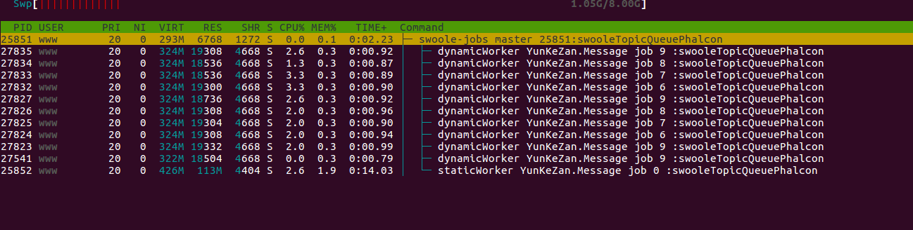
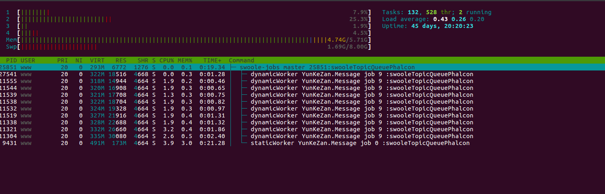
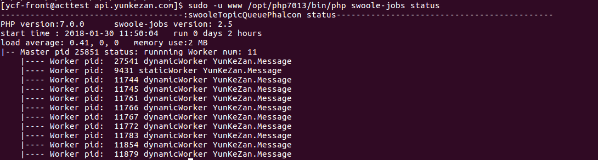

# Testing Report

#### 环境准备

#### 系统信息
* 系统：CentOS release 6.6 (Final)
* cpu： 4  QEMU Virtual CPU version (cpu64-rhel6)
* 内存：6 G

#### swoole-jobs配置
* 队列类型：rabbitmq
* 队列插入数量 MyJob

| topic名       | 插入个数  | 描述            |  最少消费进程数  | 最大消费进程数   |
| -----------   | --------| --------------- | ----  | ------ |
| MyJob         | 10万    | MyJob            | 3    |     30  |
| MyJob2        | 10万    | MyJob2           | 3    |      20 |
| MyJob3        | 0       | MyJob2           | 1     |      1   |


* topic相关
```
    'topics'  => [
        ['name'=>'MyJob', 'workerMinNum'=>3, 'workerMaxNum'=>30],
        ['name'=> 'MyJob2', 'workerMinNum'=>3, 'workerMaxNum'=>20],
        ['name'=> 'MyJob3', 'workerMinNum'=>1, 'workerMaxNum'=>1],
    ],
```

* 子进程相关
```
    'sleep'             => 2, // 队列没消息时，暂停秒数
    'queueMaxNum'       => 10, // 队列达到一定长度，启动动态子进程个数发和送消息提醒
    'maxPopNum'         => 100, // 子进程启动后每个循环最多取多少个job
    'excuteTime'        => 3600, // 子进程最长执行时间，防止内存泄漏
```


#### 系统表现

* 任务开始状态


* 10分钟之后状态


* 30分钟之后状态


* 60分钟之后状态


* 2个小时分钟之后状态


* 队列消费完成状态


#### 结论